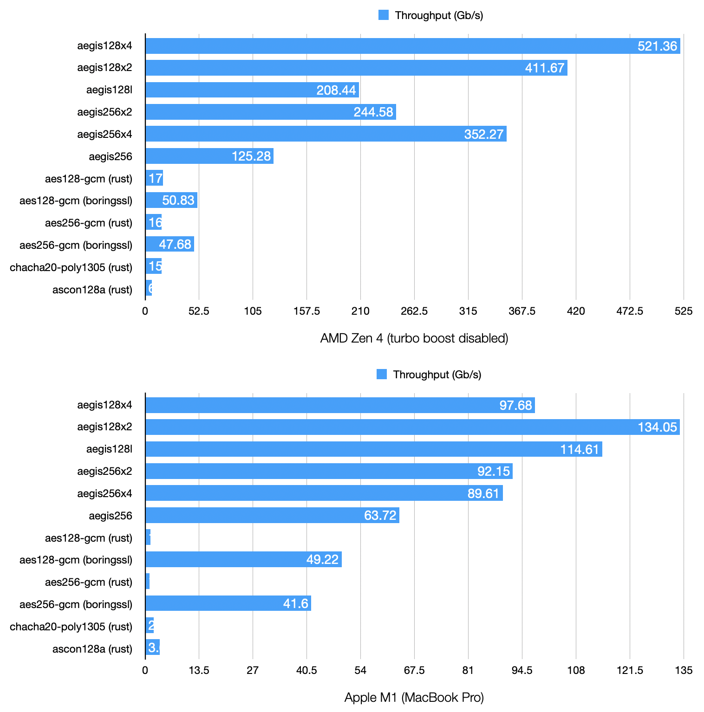
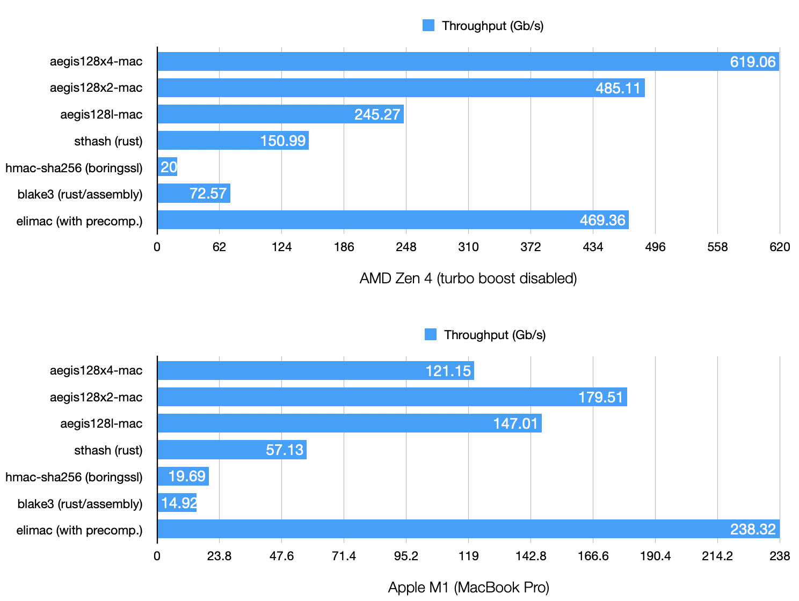
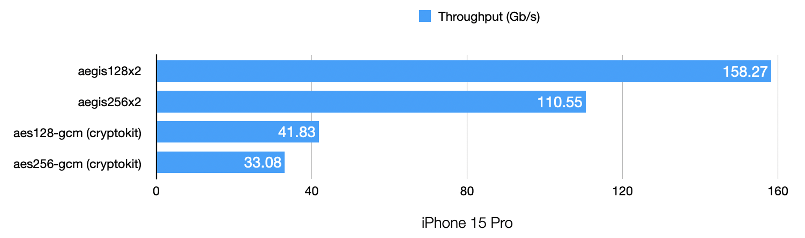

# AEGIS-128X and AEGIS-256X

- [AEGIS-128X and AEGIS-256X](#aegis-128x-and-aegis-256x)
- [Specification and rationale](#specification-and-rationale)
- [Benchmarks](#benchmarks)
  - [Ryzen 7 7700](#ryzen-7-7700)
    - [Encryption](#encryption)
    - [Authentication (MAC)](#authentication-mac)
    - [Intel i9-13900k (thanks to @watzon)](#intel-i9-13900k-thanks-to-watzon)
  - [Zig CI server - Ryzen 9](#zig-ci-server---ryzen-9)
    - [Encryption](#encryption-1)
    - [Authentication (MAC)](#authentication-mac-1)
  - [Scaleway EPYC 7543 instance](#scaleway-epyc-7543-instance)
    - [Encryption](#encryption-2)
    - [Authentication (MAC)](#authentication-mac-2)
- [Other implementations](#other-implementations)

AEGIS-128X and AEGIS-256X are proposed variants of the high performance authenticated ciphers AEGIS-128L and AEGIS-256, designed to take advantage of the vectorized AES instructions present on recent x86_64 CPUs.

# Specification and rationale

AEGIS-128X and AEGIS-256X are now included in the [AEGIS specification](https://cfrg.github.io/draft-irtf-cfrg-aegis-aead/draft-irtf-cfrg-aegis-aead.html).

Rationale: [Adding more parallelism to the AEGIS authenticated encryption algorithms](https://eprint.iacr.org/2023/523)

# Implementations

List of known [opensource AEGIS implementations](https://github.com/cfrg/draft-irtf-cfrg-aegis-aead?tab=readme-ov-file#known-implementations).

AEGIS-X is at least implemented in libaegis, jasmin-aegis and
crypto-rust in addition to the reference implementations.

# Benchmarks

AEGIS-128X has exceptional performance, even without AVX512.

### Encryption (16 KB)

### Authentication (64 KB)

### Mobile benchmarks

